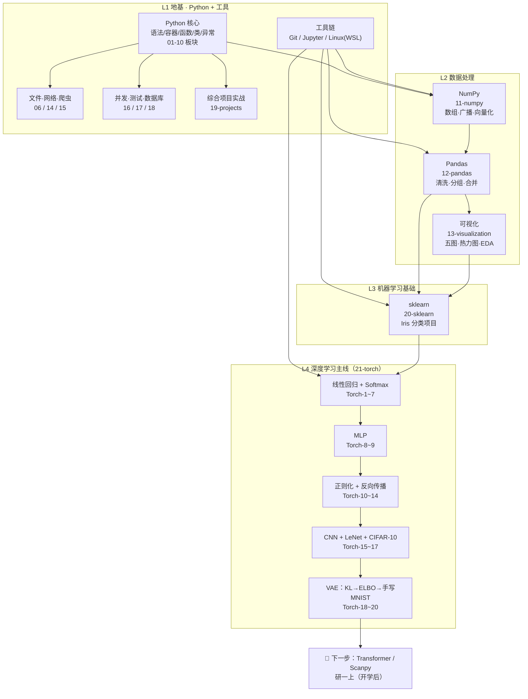

# 🗺️ 知识地图 · 暑期学习全景（2026.7-8）

> 用途：查漏补缺的自检表；后续每学一个板块回来更新。
> 与根目录 README 的区别：README 是"文件在哪"，这里回答"知识怎么长出来的、我学会了什么、哪里还虚"。
> 更新约定：每完成一个新板块（如研一上的 Transformer / Scanpy），回到这里加一个节点和一条连线。

## 0. 一张图看懂全部

## 1. L1 地基 · Python + 工具链

**这条线解决什么问题：**
- 能写程序"——语法、容器、函数/类、文件 IO、异常处理，以及 numpy 向量化运算

**已掌握（事实部分，已核对）：**
- 语法核心：变量/流程控制/数据结构/函数/模块/文件/异常/OOP/正则/标准库（01-10 板块）
- 进阶：网络请求、爬虫、数据库、并发、测试（14-18）
- 工具链：Git（add/commit/push 已在用）、Jupyter、WSL 双环境

**验收产出：** `01-basics` ~ `19-projects` 各板块 notebook（GitHub 已推）

**自查：**
- 最熟的一块：模型训练的步骤，每一步应该对应做什么事；将数据用图像的形式展现出来帮助分析
- 最虚的一块（现在说不出、要翻笔记的）：训练模型具体的到每一行应该怎么写，只会套版，不会根据需求做模型

## 2. L2 数据处理 · NumPy → Pandas → 可视化

**这条线解决什么问题：**
- 读文件、清洗、变换全是 pandas 的活（numpy 的 loadtxt 不处理缺失值和类型推断）；numpy 的职责是DataFrame → np.array 喂模型 + 底层数值运算；再用 Matplotlib / Seaborn 将这些处理过后的数据进行图像可视化来辅助对于这些数据的分析
- 完整流水线逻辑
~~~
原始文件(csv/excel)
    ↓
Pandas加载成DataFrame → 查看信息(df.info,df.describe)
    ↓
数据清洗：缺失值、异常值、重复值、格式转换
    ↓
（可选）转成NumPy数组，做底层数值运算
    ↓
可视化EDA探索数据分布、相关性
    ↓
划分训练集/测试集 → 送入深度学习/机器学习模型
~~~

**已掌握（事实部分，已核对）：**
- NumPy：数组、广播、随机数（11-numpy）
- Pandas：DataFrame 读写、清洗、分组聚合、合并（12-pandas，10 个 rules 完整跑过）
- 可视化：五基础图 + 子图/热力图/seaborn + Iris EDA 完整流程（13-visualization，3 个 notebook 刚补完）

**验收产出：**
- `12-pandas/Pandas-learning-log/Pandas Basic rules-1~10`
- `13-visualization/Visualization-learning-log/`（Matplotlib rules-1/2 + Items-1 Iris EDA）

**自查：**
- 处理 10 万行 CSV 时第一步会做什么：第一步 = df.shape → df.info() → df.isna().sum() + df.describe()（全量统计概览），抽样只是辅助肉眼看。
- 可视化自测暴露的薄弱点（迁移/场景类，还记得批改结论吗）：对于具体的例子来解释对应的现象时不能够想出恰当的例子，有些参数的使用的理解还比较片面，有些只知道它有什么用但不知为何要这么用

## 3. L3 机器学习基础 · sklearn

**这条线解决什么问题：**
- 监督学习的最简形态 —— 给特征和标签，训练一个分类器，从历史标注数据中学到特征与类别之间的映射规则，最终可以对全新、无标签的数据自动预测它所属的类别；同时完成模型效果评估、超参数调优，验证模型是否具备泛化预测能力

**已掌握（事实部分，已核对）：**
- sklearn 数据预处理、Iris 完整分类项目、模型评估

**验收产出：** `20-sklearn/Sklearn-learning-log/SK Basic rules-1/2 + SK Items-1-Iris`

**自查：**
- "训练集/测试集为什么要分开"：训练集和数据集必然是要分开的，训练集是用来让模型去学习这部分被批注过的数据来获得这批数据的特征，训练集=带标签，给模型学；测试集=也有标签，但模型训练全程看不见，只在最后用于评估泛化，loss 有多大，泛化能力够不够强，是否有欠/过拟合问题，并根据这些得出的数据来进行参数或环节的优化，是模型达到一个更好的效果，类似于高考生刷模拟卷和摸底考试的关系，为了能在高考得到更好的成绩

## 4. L4 深度学习主线 · PyTorch（暑期核心产出）

**这条线解决什么问题：**
- 从 "调包分类" 到 "自己搭神经网络并训练"：脱离黑盒模型调用，自主搭建神经网络、编写完整训练流程，拟合复杂非线性关系，可相对自由定制深度模型，解决部分高维、传统机器学习难以处理的任务

**已掌握（事实部分，已核对，Torch-1~21）：**
- 主线依赖链：线性回归 → Softmax 分类 → MLP（隐藏层/激活函数）→ 过拟合与正则（权重衰减/Dropout）→ 反向传播原理 → CNN（卷积/填充/步幅/多通道/池化）→ LeNet → CIFAR-10 实战 → KL 散度 → VAE 原理（ELBO/重参数化）→ 手写 VAE on MNIST → Dataset/DataLoader

**验收产出：** `21-torch/Torch-learning-log/Torch-1~21` + `vae_mnist.pt`（本地存档）

**自查：**
- 能不能不看 notebook，把"从 x 到 loss 再到梯度更新"的完整链条讲出来：输入数据 x 前向传播算出预测值，对比真实标签计算损失；反向传播求出各权重梯度，优化器利用梯度更新权重，最后清空梯度，开启下一轮迭代
- CIFAR-10 准确率是多少、卡在哪（如实写，不设指标）：最终准确率在 72% 左右，最开始出现过拟合现象，加了 Dropout + weight_decay 去调节降低过拟合，但正则过度变成了欠拟合，最后用 数据增强 + 余弦退火 的方案使得准确率达到 72% 左右。72% 后再提升的路径：① ImageNet 预训练模型微调（ResNet18 微调可到 90%+）② 更强数据增强（CutMix/AutoAugment）③ 更大模型 + 更长训练。

## 5. 横向技能（不属于任一 L，但贯穿全部）

| 技能 | 用途 | 熟练度自查（你填：会用/顺手/卡壳） |
|------|------|------|
| Git | 所有代码入库（铁律②） |会用 |
| Jupyter | 逐 cell 学习工作流 | 顺手|
| WSL/Linux | 开发环境 |会用 |
| Conda | 开学后装 Transformer/Scanpy 环境必用 |会用 |

## 6. 下一步（开学后回到这里更新）

- [ ] d2l 第 10 章：注意力机制（10.1-10.3）→ 多头（10.5）→ 位置编码（10.6）→ Transformer（10.7）
- [ ] Scanpy PBMC3k 全流程
- [ ] 论文精读：Geneformer → scGPT
- [ ] 每完成一块，回本文件加节点/连线

---
*生成于 2026-08-30 · 事实部分由 AI 对照本地文件核对，自查部分待本人填写*
